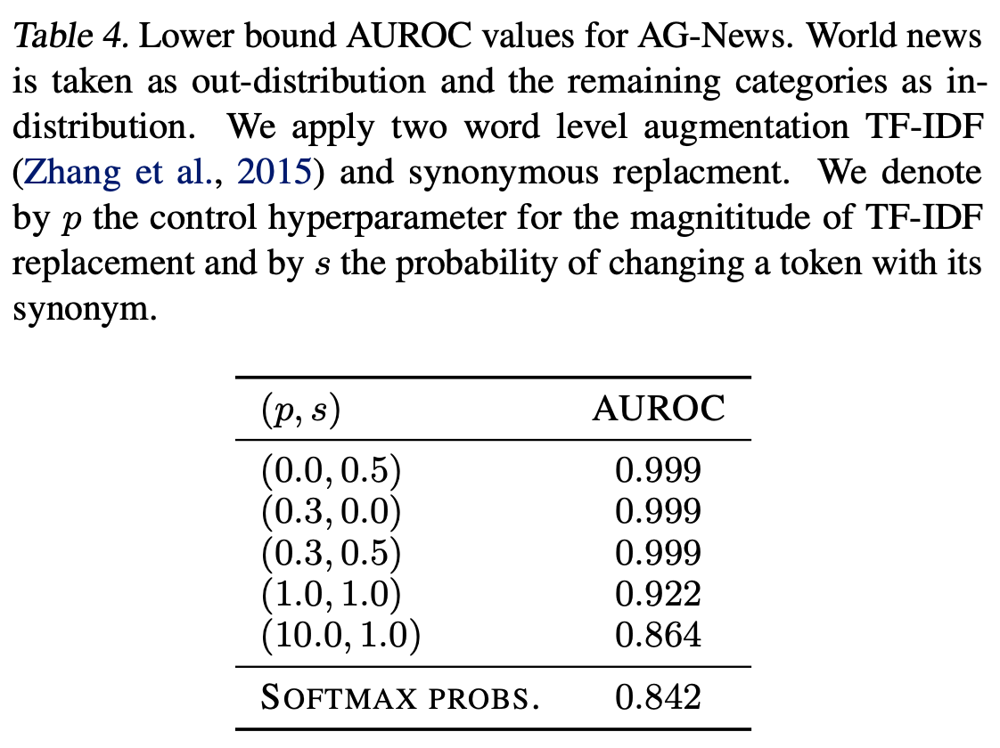
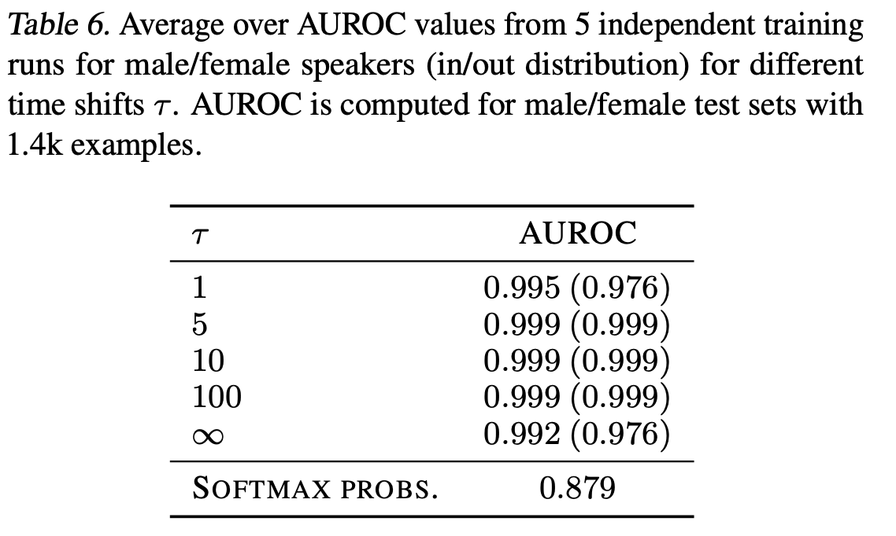

# We are still updating this repo 
## PyTorch-SemSAD

PyTorch implementation of [UNSUPERVISED ANOMALY DETECTION FROM SEMANTIC SIMILARITY SCORES](https://arxiv.org/abs/2012.00461).

[SemSAD](https://arxiv.org/abs/2012.00461) is a simple and generic framework for detecting examples that lie out-of-distribution (OOD) for a given training set. Our approach is based on learning a semantic similarity measure to find for a given test example the semantically closest example in the training set and then using a discriminator to classify whether the two examples show sufficient semantic dissimilarity such that the test example can be rejected as OOD. 

</img>

</img>

</img>

</img>

Commands used to train the encoder and the discriminator in the paper for [ImageData](https://github.com/nimaous/SemSAD/blob/main/ImageData/commands.txt), [TextData](https://github.com/nimaous/SemSAD/blob/main/TextData/commands.txt) and [AudioData](https://github.com/nimaous/SemSAD/blob/main/AudioData/commands.txt) 

Download our trained models for [ImageData](https://github.com/nimaous/SemSAD/tree/main/ImageData/trained_models), [TextData](https://github.com/nimaous/SemSAD/tree/main/TextData/trained_models) and [AudioData](https://github.com/nimaous/SemSAD/tree/main/AudioData/trained_models)

# Package dependencies
listed [here](https://github.com/nimaous/SemSAD/blob/main/package_version.txt)

