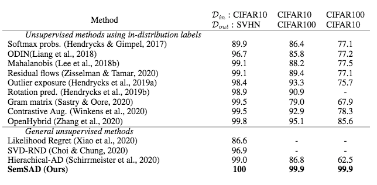
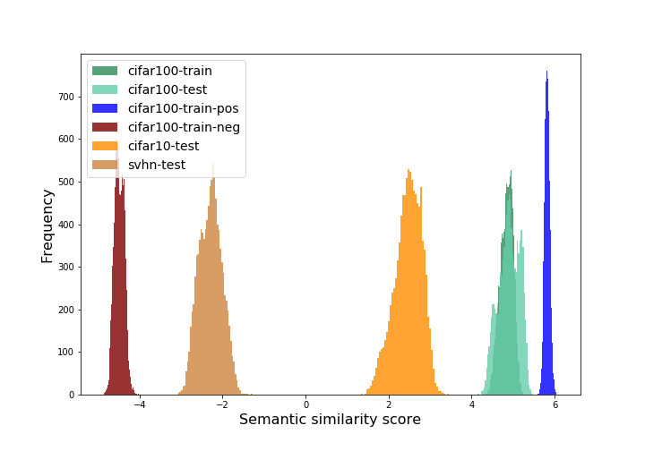
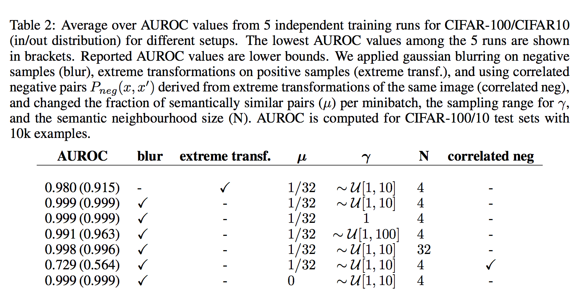

# UNSUPERVISED ANOMALY DETECTION FROM SEMANTIC SIMILARITY SCORES

This repository contains PyTorch code for the [SemSAD paper]().

SemSAD is a simple and generic framework for detecting examples that lie out-of-distribution (OOD) for a given training set. Our approach is based on learning a semantic similarity measure to find for a given test example the semantically closest example in the training set and then using a discriminator to classify whether the two examples show sufficient semantic dissimilarity such that the test example can be rejected as OOD. 

<figure>
    
    
    <figcaption>&nbspTable 1: Out-of-distribution detection performance (% AUROC). Reported values for SemSAD are lower bounds.
    </figcaption>
    
</figure>

<figure>
    
    
    <figcaption>Figure 4: Distributions over the semantic similiarity score, s(x, x′), trained on CIFAR-100 pos/neg pairs ( in blue;  in red) as described in Section 4.1 and applied to semantic nearest- neighbour pairs from the test sets of SVHN and CIFAR-10 (out-distributions) in comparison to semantic nearest-neighbour pairs of the CIFAR-100 test/train sets (in-distributions).
    </figcaption>
    
</figure>

<figure>
    
    
    <figcaption> 
&nbspTable 2: Average over AUROC values from 5 independent training runs for CIFAR-100/CIFAR10 (in/out distribution) for different setups. The lowest AUROC values among the 5 runs are shown in brackets. Reported AUROC values are lower bounds. We applied gaussian blurring on negative samples (blur), extreme transformations on positive samples (extreme transf.), and using correlated negative pairs  derived from extreme transformations of the same image (correlated neg), and changed the fraction of semantically similar pairs (μ) per minibatch, the sampling range for γ, and the semantic neighbourhood size (N). AUROC is computed for CIFAR-100/10 test sets with 10k examples. 
    </figcaption>
    
</figure>

Commands used to train the encoder and the discriminator in the paper [here](https://github.com/nimaous/SemSAD/blob/main/commands.txt) 

Download our trained models [here]()

# Package dependencies
listed [here](https://github.com/nimaous/SemSAD/blob/main/package_version.txt)

# Citation

