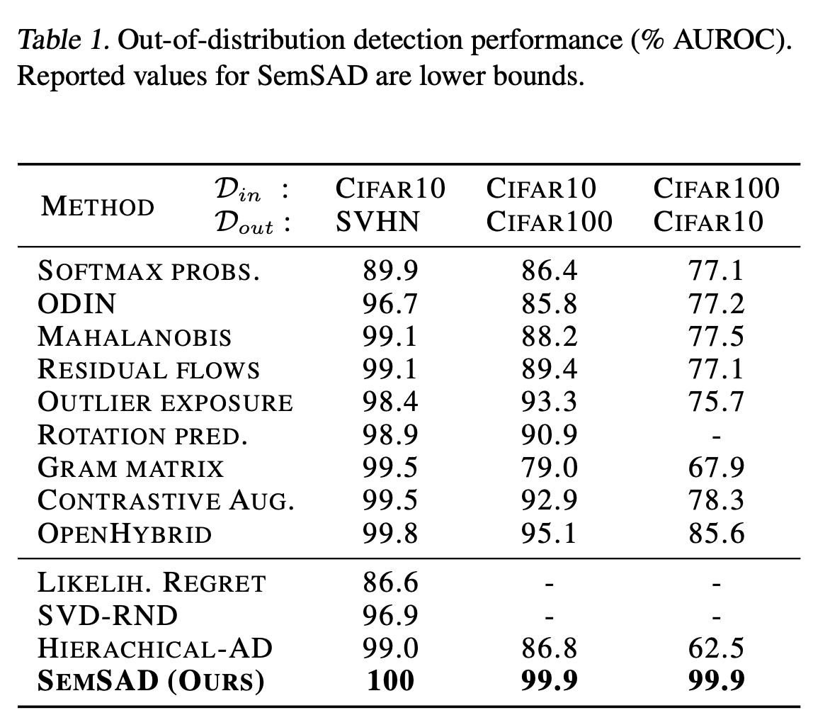
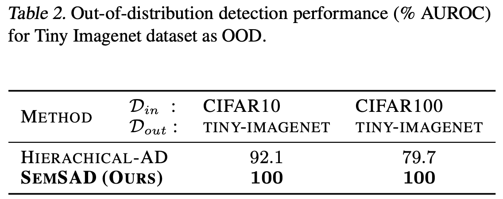

# We are still updating this repo 
## UNSUPERVISED ANOMALY DETECTION FROM SEMANTIC SIMILARITY SCORES

This repository contains PyTorch code for the [SemSAD paper](https://arxiv.org/abs/2012.00461).

SemSAD is a simple and generic framework for detecting examples that lie out-of-distribution (OOD) for a given training set. Our approach is based on learning a semantic similarity measure to find for a given test example the semantically closest example in the training set and then using a discriminator to classify whether the two examples show sufficient semantic dissimilarity such that the test example can be rejected as OOD. 

</img>

</img>

  

    
  

  

    
  

Commands used to train the encoder and the discriminator in the paper [here](https://github.com/nimaous/SemSAD/blob/main/commands.txt) 

Download our trained models for ImageData [here](https://github.com/nimaous/SemSAD/tree/main/ImageData/trained_models), TextData [here](https://github.com/nimaous/SemSAD/tree/main/TextData/trained_models) and AudioData [here](https://github.com/nimaous/SemSAD/tree/main/AudioData/trained_models)

# Package dependencies
listed [here](https://github.com/nimaous/SemSAD/blob/main/package_version.txt)

